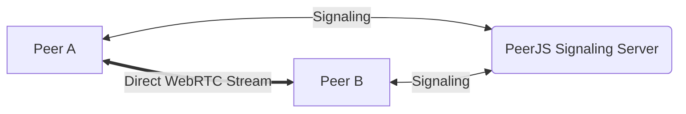
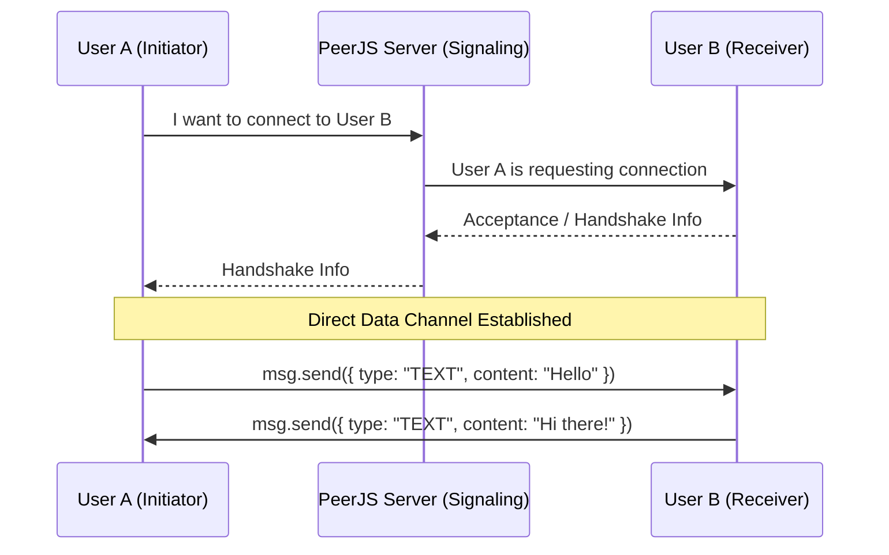
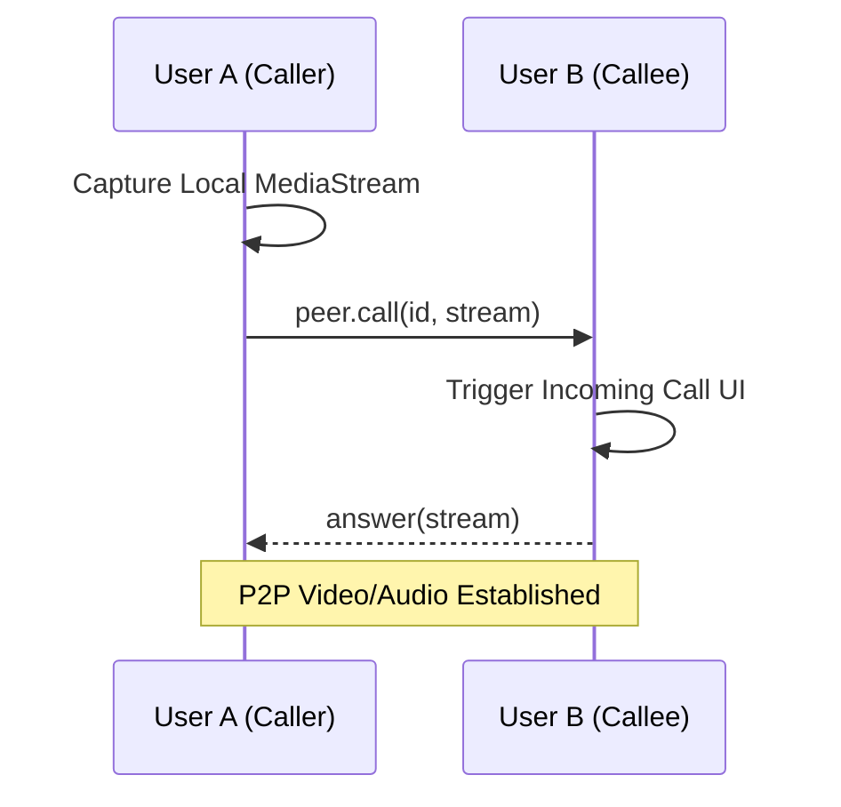
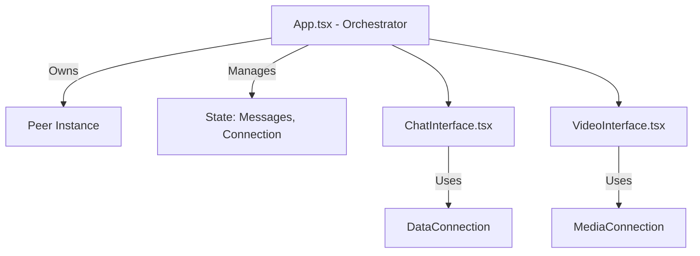

# Project P2P Architecture: Nexus P2P

This document outlines the technical implementation of the Peer-to-Peer (P2P) communication system used in the Nexus P2P application.

## 1. Overview
Nexus P2P uses **PeerJS**, a wrapper over the WebRTC API, to facilitate direct browser-to-browser communication without a centralized server handling the data or media streams (except for signaling).



## 2. Peer Initialization
When a user "logs in" (provides a name and avatar), a `Peer` instance is initialized in `App.tsx`:

```typescript
const newPeer = new Peer();
```

- **Peer ID**: PeerJS automatically assigns a unique ID to the user if one isn't provided. This ID acts as the "address" for other peers to connect.
- **Signaling**: The initial handshake (exchange of metadata like SDP and ICE candidates) is handled by the default PeerJS cloud signaling server.

## 3. Data Communication (Chat)
Data exchange (text messages, file metadata, system notifications) is handled through `DataConnection` objects.

### Connection Flow:


1. **Initiation**: User A enters User B's Peer ID and clicks connect. `peer.connect(targetPeerId)` is called.
2. **Acceptance**: User B listens for the `connection` event:
   ```typescript
   peer.on('connection', (conn) => {
     // Handle the incoming data connection
   });
   ```
3. **Transmission**: Messages are sent using `conn.send(data)`. In this project, data is typically a `ChatMessage` object containing the sender's info, content, type (TEXT/FILE/SYSTEM), and timestamp.

### Robustness:
- **Event Listeners**: Both peers listen for `data`, `close`, and `error` events to update the UI state in real-time.
- **System Messages**: When a peer disconnects, a system message is automatically appended to the chat log to inform the user.

## 4. Media Communication (Video/Audio)
Real-time video and audio streams are handled via `MediaConnection` (calls).

### Communication Flow:


1. **Calling**: User A initiates a call using `peer.call(targetPeerId, localStream)`.
2. **Answering**: User B receives a `call` event, which triggers the `VideoInterface` component to show an "incoming call" overlay.
3. **Streaming**: Once answered, both peers exchange `MediaStream` objects which are rendered in `<video>` elements.

## 5. Security & Privacy
- **Direct Link**: After the initial signaling handshake, the data travels directly between browsers (unless a TURN server is required for NAT traversal, in which case it is encrypted in transit).
- **No Persistence**: Messages and session data are stored only in React state and are lost upon page refresh or logout, ensuring no permanent trail on a server.
- **Encrypted Transfers**: WebRTC natively provides end-to-end encryption for all data and media streams.

## 6. Key Components


- **PeerJS**: The engine for WebRTC abstraction.
- **App.tsx**: The central orchestrator that manages peer lifecycle and state.
- **ChatInterface.tsx**: Handles the UI for sending/receiving data via the `DataConnection`.
- **VideoInterface.tsx**: Manages `MediaStream` acquisition and rendering for calls.
- **QrScanner/QRCodeCanvas**: Utilities to easily share and input Peer IDs.

## 7. Configuration Defaults
The project currently uses the default PeerJS configuration (connecting to the public PeerJS server). For production environments with strict firewalls, a custom TURN server configuration would be added to the `Peer` constructor options.
