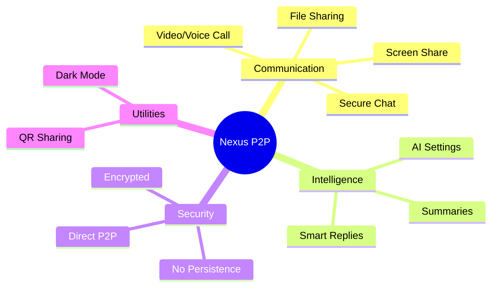

# Nexus P2P

A WebRTC Peer-to-Peer communication app with Chat, Video, Screen Sharing, and Gemini AI integration.



## How to Run

1.  **Install Dependencies**:
    ```bash
    npm install
    ```

2.  **Setup Environment**:
    Create a file named `.env` in the root directory and add your Google Gemini API Key:
    ```
    API_KEY=your_actual_api_key_here
    ```

3.  **Run Development Server**:
    ```bash
    npm run dev
    ```

4.  **Open in Browser**:
    Visit `http://localhost:5173`

## Features

*   **Multi-User Room Support**: Host meetings or join existing ones via Room IDs.
*   **Star-Mesh Topology**: Seamlessly connect with multiple participants in a single session.
*   **P2P Video/Voice Grid**: Handles multiple video streams in a dynamic layout.
*   **Screen Sharing**: Toggle between camera and screen share.
*   **Secure Chat**: Full-mesh peer-to-peer data connection.
*   **File Sharing**: Send files directly to peers (size limit 2GB).
*   **AI Integration**: Uses Gemini Flash 2.5 for Smart Replies and Conversation Summaries.

## Documentation

For a detailed explanation of the project's technical implementation of Peer-to-Peer communication, see the [ARCHITECTURE_P2P.md](./ARCHITECTURE_P2P.md) file.
