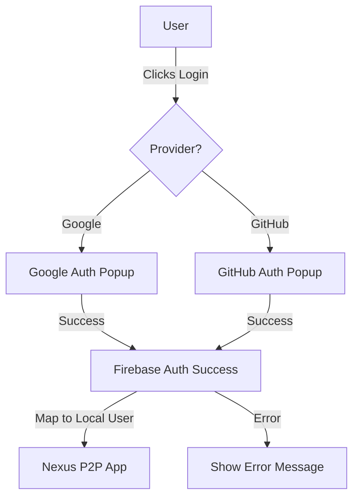

# Social Login Setup Guide (Firebase)

This guide explains how to replace the current mock login system with real social authentication using Firebase.



## Step 1: Create a Firebase Project
1. Visit the [Firebase Console](https://console.firebase.google.com/).
2. Click **"Add project"** and follow the setup wizard (you can disable Google Analytics for now).
3. Once the project is created, click the **Web icon (`</>`)** to register a new web app.
4. Give it a nickname (e.g., "Nexus-P2P") and click **"Register app"**.
5. You will see a `firebaseConfig` object. Keep this tab open; you'll need these values.

## Step 2: Enable Authentication Providers
1. In the Firebase left-hand menu, go to **Build > Authentication**.
2. Click **"Get started"**.
3. Go to the **"Sign-in method"** tab.
4. Click **"Add new provider"** and select **Google**.
   - Enable it, provide a support email, and click **Save**.
5. (Optional) For **GitHub**:
   - You will need to create a GitHub OAuth App in your [GitHub Developer Settings](https://github.com/settings/developers).
   - Copy the "Callback URL" provided by Firebase into your GitHub app settings.
   - Copy the GitHub "Client ID" and "Client Secret" into the Firebase Console.

## Step 3: Configure Your Application
Create or update your `.env` file in the root of your project with the following (prefix with `VITE_` to expose them to the client):

```env
VITE_FIREBASE_API_KEY=your_api_key
VITE_FIREBASE_AUTH_DOMAIN=your_project_id.firebaseapp.com
VITE_FIREBASE_PROJECT_ID=your_project_id
VITE_FIREBASE_STORAGE_BUCKET=your_project_id.appspot.com
VITE_FIREBASE_MESSAGING_SENDER_ID=your_sender_id
VITE_FIREBASE_APP_ID=your_app_id
```

## Step 4: Implement Firebase in Code

### 1. Install Dependencies
Run the following in your terminal:
```bash
npm install firebase
```

### 2. Create the Firebase Service (`/src/services/firebase.ts`)
```ts
import { initializeApp } from "firebase/app";
import { getAuth, GoogleAuthProvider, GithubAuthProvider, signInWithPopup } from "firebase/auth";

const firebaseConfig = {
  apiKey: import.meta.env.VITE_FIREBASE_API_KEY,
  authDomain: import.meta.env.VITE_FIREBASE_AUTH_DOMAIN,
  projectId: import.meta.env.VITE_FIREBASE_PROJECT_ID,
  storageBucket: import.meta.env.VITE_FIREBASE_STORAGE_BUCKET,
  messagingSenderId: import.meta.env.VITE_FIREBASE_MESSAGING_SENDER_ID,
  appId: import.meta.env.VITE_FIREBASE_APP_ID
};

const app = initializeApp(firebaseConfig);
export const auth = getAuth(app);
export const googleProvider = new GoogleAuthProvider();
export const githubProvider = new GithubAuthProvider();
```

### 3. Update `Login.tsx`
Replace the mock logic with real Firebase calls:

```tsx
import { auth, googleProvider, githubProvider } from '../services/firebase';
import { signInWithPopup } from "firebase/auth";

// ... inside handleLogin ...
const handleLogin = async (providerName: string) => {
  setLoadingProvider(providerName);
  try {
    let result;
    if (providerName === 'Google') {
      result = await signInWithPopup(auth, googleProvider);
    } else if (providerName === 'GitHub') {
      result = await signInWithPopup(auth, githubProvider);
    }
    
    if (result) {
      const firebaseUser = result.user;
      onLogin({
        id: firebaseUser.uid,
        name: firebaseUser.displayName || 'User',
        avatarUrl: firebaseUser.photoURL || 'default-avatar-url'
      });
    }
  } catch (error) {
    console.error("Login failed", error);
  } finally {
    setLoadingProvider(null);
  }
};
```

## Summary of URLs to Visit:
- **Firebase Console:** [https://console.firebase.google.com/](https://console.firebase.google.com/)
- **GitHub Developer Settings (for GitHub Login):** [https://github.com/settings/developers](https://github.com/settings/developers)
